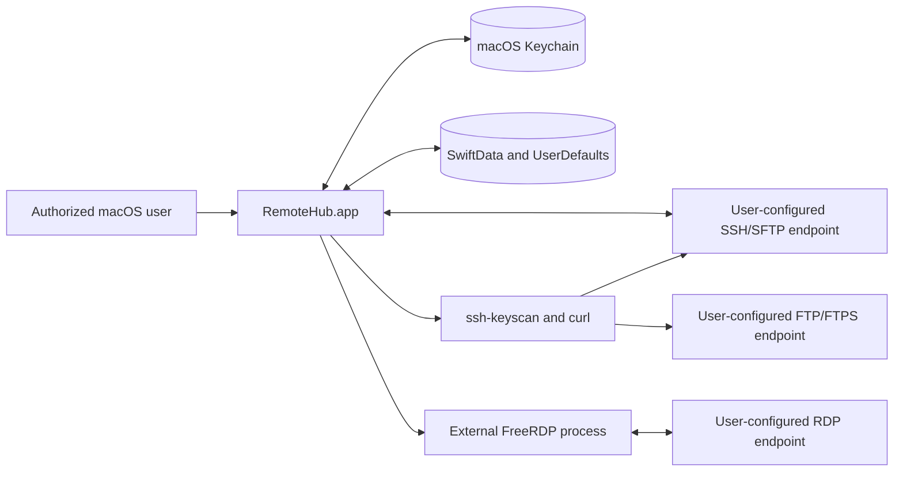
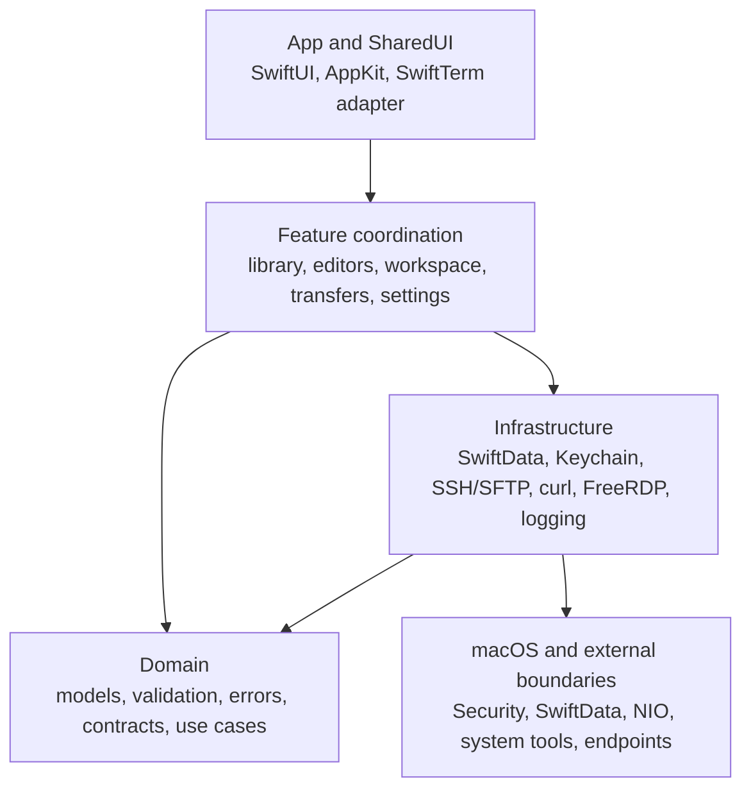
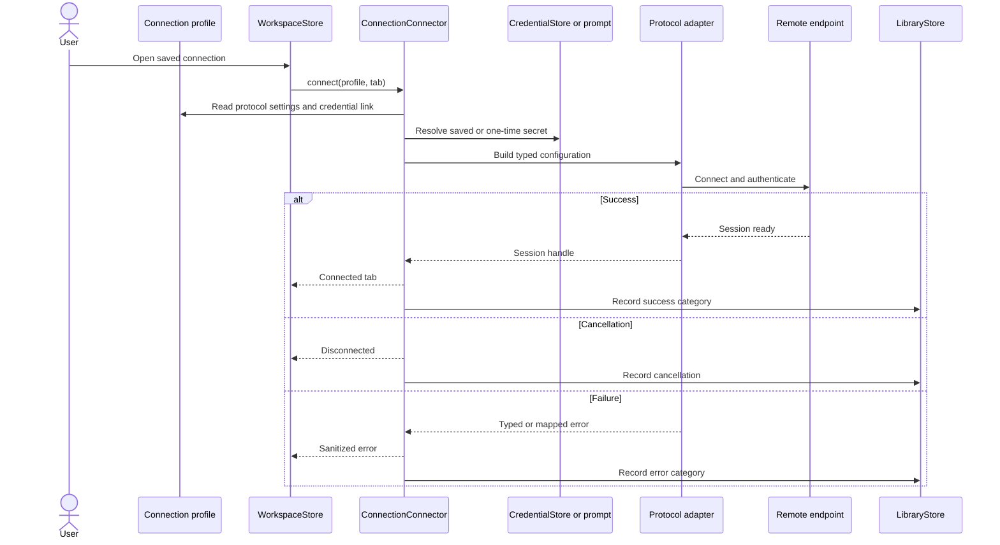
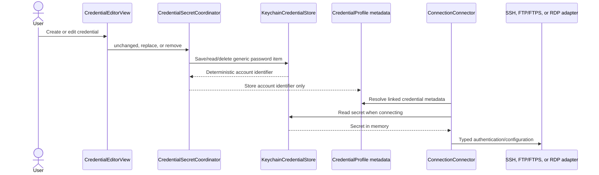
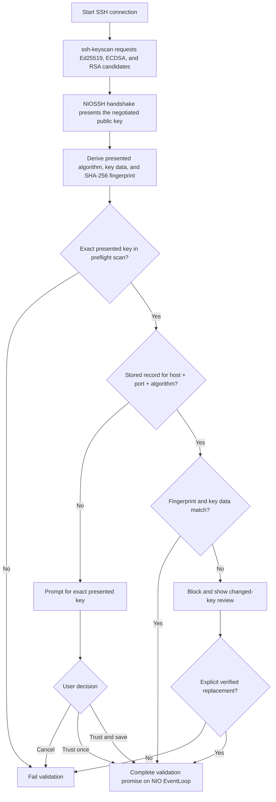
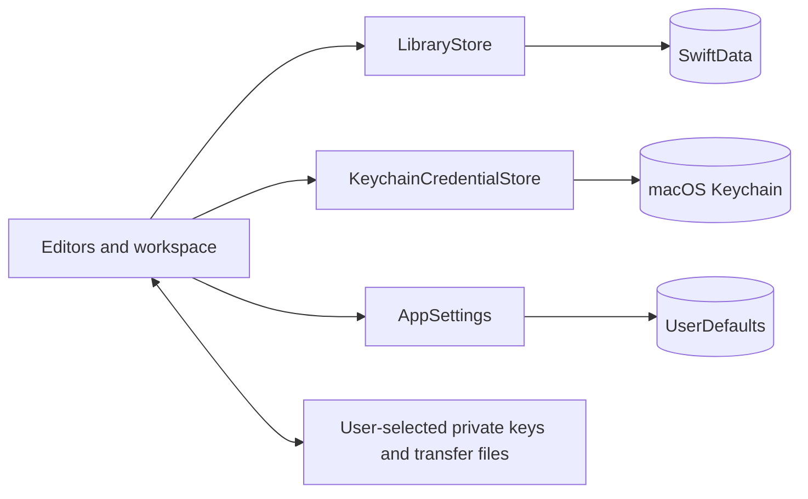
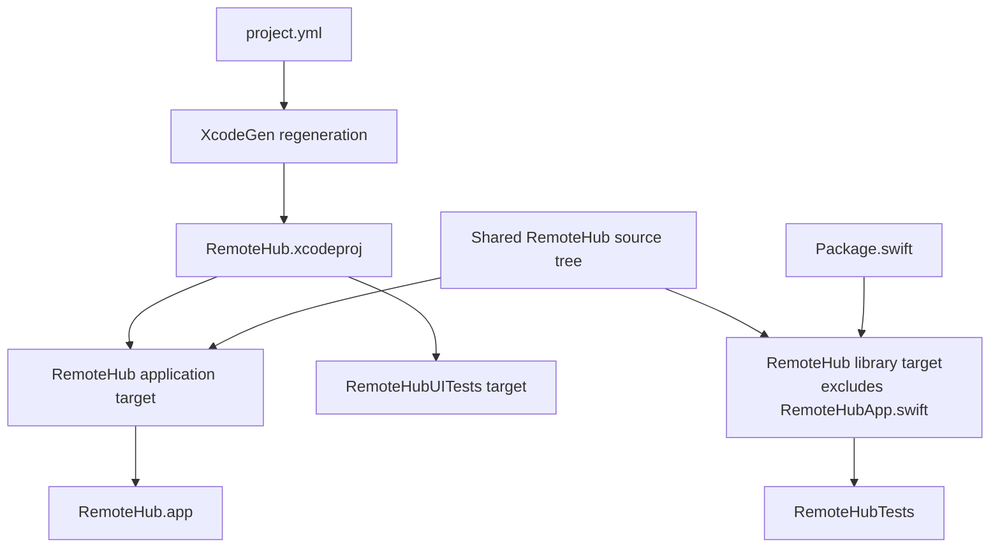

# System Overview

## Scope

RemoteHub is a native SwiftUI macOS application with local persistence and
protocol adapters for SSH, SFTP, FTP, FTPS, and external RDP. This document
describes the architecture at commit `b4f0316`; it is not a deployment diagram
for any particular infrastructure.

## System context

RemoteHub has no application-managed cloud service in the reviewed source. It
connects directly or through local system/external tools to endpoints selected
by the user.

## Layered architecture

The dependency direction is enforced primarily through domain protocols such
as `SSHTransport`, `SSHSession`, `SFTPSession`, `FTPClient`, and
`RDPLaunching` in
[`TransportProtocols.swift`](../../RemoteHub/Domain/Protocols/TransportProtocols.swift).
Tests supply fakes for these boundaries.

## Main runtime components

| Component | Responsibility | Source |
| --- | --- | --- |
| Application entry | Creates the native scenes, model container, settings scene, and commands | [`RemoteHubApp.swift`](../../RemoteHub/App/RemoteHubApp.swift) |
| Composition root | Constructs SwiftData, Keychain store, prompts, transfer queue, connector, and workspace | [`AppContainer.swift`](../../RemoteHub/App/AppContainer.swift) |
| Root navigation | Routes dashboard, library, credentials, workspace, settings, sheets, and command notifications | [`RootView.swift`](../../RemoteHub/App/RootView.swift) |
| App commands | Defines Command-N, Command-K, Command-R, Command-Shift-F, and Command-W | [`AppCommands.swift`](../../RemoteHub/App/AppCommands.swift) |
| Local library | Validates and persists groups, credentials, connections, known hosts, attempts, and imports | [`LibraryStore.swift`](../../RemoteHub/Infrastructure/Persistence/LibraryStore.swift) |
| Connection coordinator | Resolves credentials and settings, selects the protocol adapter, records outcome categories | [`ConnectionConnector.swift`](../../RemoteHub/Features/Workspace/ConnectionConnector.swift) |
| Workspace lifecycle | Owns tabs, connection tasks, reconnect, close, and protocol disconnect | [`WorkspaceStore.swift`](../../RemoteHub/Features/Workspace/WorkspaceStore.swift) |
| SSH transport | Scans keys, validates the negotiated key, authenticates, and creates SSH/PTTY sessions | [`CitadelSSHTransport.swift`](../../RemoteHub/Infrastructure/SSH/CitadelSSHTransport.swift) |
| SFTP adapter | Wraps Citadel SFTP operations and streaming transfers | [`CitadelSFTPSession.swift`](../../RemoteHub/Infrastructure/SFTP/CitadelSFTPSession.swift) |
| FTP/FTPS adapter | Builds and executes typed system-curl requests with credentials on standard input | [`CurlCLIFTPClient.swift`](../../RemoteHub/Infrastructure/FTP/CurlCLIFTPClient.swift) |
| RDP adapter | Resolves bundled FreeRDP first, performs DNS/TCP preflight, launches it directly, captures output, maps failures, and tracks lifecycle | [`FreeRDPLauncher.swift`](../../RemoteHub/Infrastructure/RDP/FreeRDPLauncher.swift) |
| Transfer queue | Bounds concurrency, prevents active duplicates, and handles cancel/retry/progress | [`TransferQueue.swift`](../../RemoteHub/Features/Transfers/TransferQueue.swift) |
| Error/log boundary | Uses typed error categories, sanitization, and protocol-only OSLog events | [`RemoteHubError.swift`](../../RemoteHub/Domain/Errors/RemoteHubError.swift), [`Redactor.swift`](../../RemoteHub/Infrastructure/Logging/Redactor.swift), [`AppLog.swift`](../../RemoteHub/Infrastructure/Logging/AppLog.swift) |

Observable UI and feature state is main-actor isolated. Network/session
interfaces are asynchronous and `Sendable`. Private unchecked-Sendable wrappers
are limited to dependency types that Citadel 0.12.1 does not annotate.

## Connection flow

Protocol selection and attempt recording are in
[`ConnectionConnector.swift`](../../RemoteHub/Features/Workspace/ConnectionConnector.swift).
Only outcome and error category are retained in a `ConnectionAttempt`; no
terminal content or password is part of that model.

## Credential and Keychain flow

The Keychain service and accessibility settings are implemented in
[`CredentialStore.swift`](../../RemoteHub/Infrastructure/Keychain/CredentialStore.swift).
Credential metadata is defined in
[`PersistenceModels.swift`](../../RemoteHub/Domain/Models/PersistenceModels.swift).
The source does not assert secure memory erasure after Swift strings leave
scope.

## SSH host-key trust flow

`ssh-keyscan` order does not select the trusted key. The custom NIOSSH
authentication delegate receives the actual handshake key, resolves its
algorithm and SHA-256 fingerprint, binds it to the matching scan result, and
then evaluates that exact key. Trust records are separated by normalized host,
port, and algorithm. A changed fingerprint for an existing algorithm is
blocked until explicit replacement; an additional algorithm is prompted
independently.

The delegate leaves the NIO event loop before awaiting the UI/trust actor and
completes the NIO promise back on its event loop. Sources:
[`CitadelSSHTransport.swift`](../../RemoteHub/Infrastructure/SSH/CitadelSSHTransport.swift),
[`SSHHostKeyScanner.swift`](../../RemoteHub/Infrastructure/SSH/SSHHostKeyScanner.swift),
[`HostKeyTrust.swift`](../../RemoteHub/Infrastructure/SSH/HostKeyTrust.swift),
and
[`LibraryStore.swift`](../../RemoteHub/Infrastructure/Persistence/LibraryStore.swift).

## PTY concurrency boundary

The Citadel PTY closure is created by the non-actor-isolated
`CitadelPTYDriver`; it does not capture the `CitadelSSHSession` actor. A
`SSHPTYBridge` actor installs a writer, forwards output, rejects send/resize
before readiness, and completes the output stream once. `SSHPTYController`
serializes start and disconnect, cancels its task, and waits for completion.
This design is contained in
[`CitadelSSHTransport.swift`](../../RemoteHub/Infrastructure/SSH/CitadelSSHTransport.swift)
and tested by
[`SSHPTYControllerTests.swift`](../../RemoteHubTests/SSHPTYControllerTests.swift).

## Persistence boundary

| Boundary | Stored data | Explicit exclusions or caveats |
| --- | --- | --- |
| SwiftData | Connection/group/credential metadata, settings, host-key records, recent attempt categories | No plaintext password/passphrase property; metadata such as hostnames and notes can still be sensitive |
| Keychain | Login passwords and SSH key passphrases | Non-synchronizing, `WhenUnlockedThisDeviceOnly`; no claim of biometric access control |
| UserDefaults | UI, transfer, FreeRDP, and security-related preferences | Not a secret store |
| Filesystem | User-selected private keys and transfer files | Application is not sandboxed; private keys remain user-managed; the current credential “bookmark” data is path bytes rather than a security-scoped bookmark |
| Export JSON | Selected connection/group data and optional credential metadata | No passwords, passphrases, Keychain data, private-key contents, or sessions |

SwiftData is initialized with an explicit schema and migration plan in
[`AppContainer.swift`](../../RemoteHub/App/AppContainer.swift) and
[`PersistenceModels.swift`](../../RemoteHub/Domain/Models/PersistenceModels.swift).
The code lets SwiftData select its standard local storage location rather than
hard-coding a database path.

## External dependencies and platform services

| Dependency or service | Role | Boundary evidence |
| --- | --- | --- |
| SwiftUI, AppKit, SwiftData | Native UI, responder chain, and local model persistence | Application source and [`project.yml`](../../project.yml) |
| Security framework | Generic-password Keychain items | [`CredentialStore.swift`](../../RemoteHub/Infrastructure/Keychain/CredentialStore.swift) |
| SwiftTerm 1.14.0 | Terminal view/emulation | [`SwiftTermView.swift`](../../RemoteHub/SharedUI/Components/SwiftTermView.swift) |
| Citadel 0.12.1 | High-level SSH/SFTP client | SSH/SFTP infrastructure source |
| SwiftNIO SSH fork 0.3.4 and SwiftNIO 2.83.0 | SSH protocol and event-loop transport | [`Package.resolved`](../../Package.resolved) |
| Swift Crypto 3.12.3 | SSH key parsing/cryptographic operations | SSH transport and resolved dependencies |
| `/usr/bin/ssh-keyscan` | Preflight collection of supported host-key candidates | [`SSHHostKeyScanner.swift`](../../RemoteHub/Infrastructure/SSH/SSHHostKeyScanner.swift) |
| `/usr/bin/curl` | FTP and FTPS subprocess adapter | [`CurlCLIFTPClient.swift`](../../RemoteHub/Infrastructure/FTP/CurlCLIFTPClient.swift) |
| Bundled SDL FreeRDP | Separately signed native RDP client process with dylibraries under `Contents/Frameworks` | [`FreeRDPLauncher.swift`](../../RemoteHub/Infrastructure/RDP/FreeRDPLauncher.swift) |
| OSLog | Categorized local application logging | [`AppLog.swift`](../../RemoteHub/Infrastructure/Logging/AppLog.swift) |

Versions and notices are maintained in
[`Package.resolved`](../../Package.resolved) and
[`THIRD_PARTY_NOTICES.md`](../../THIRD_PARTY_NOTICES.md).

## Build architecture

The native Xcode target is the only application entry point. It supplies the
macOS application product, Info.plist, bundle identifier, local signing,
asset catalog, dependencies, and UI-test host. `project.yml` is the declarative
source used to regenerate the checked-in project.

`Package.swift` defines the same application source as a library, excluding
only `RemoteHubApp.swift`, so unit tests remain reproducible through Swift
Package Manager without creating a second bare executable. Build and
verification commands are coordinated by [`Makefile`](../../Makefile) and
[`Scripts/`](../../Scripts/).

The current GitHub Actions workflow runs package resolution, `make build`, and
`make test` on `macos-latest`. It does not currently run `make ui-test`,
`make lint`, or `make core-check`, and it does not pin an exact Xcode image.
See [`.github/workflows/ci.yml`](../../.github/workflows/ci.yml).

## Evidence and known limitations

This architecture was reconciled against source, build configuration,
dependency resolution, and tests. Current release-preparation command results
are in
[`PUBLIC_RELEASE_AUDIT.md`](../../PUBLIC_RELEASE_AUDIT.md).

Known gaps include incomplete live interoperability coverage, no sandbox,
pending FreeRDP payload review/notarization, and modeled but inactive SSH
reconnect/keepalive settings. See
[`known-limitations.md`](../known-limitations.md).
