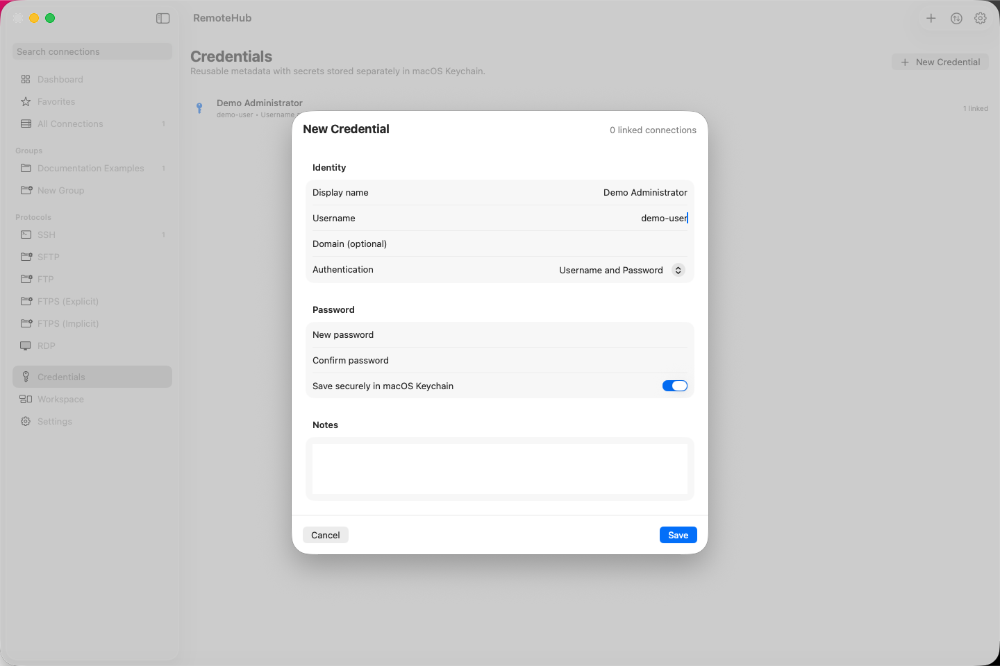
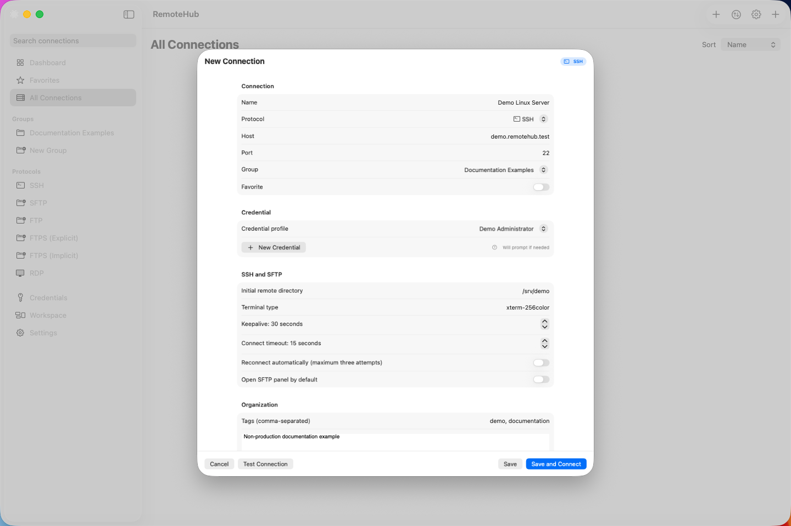
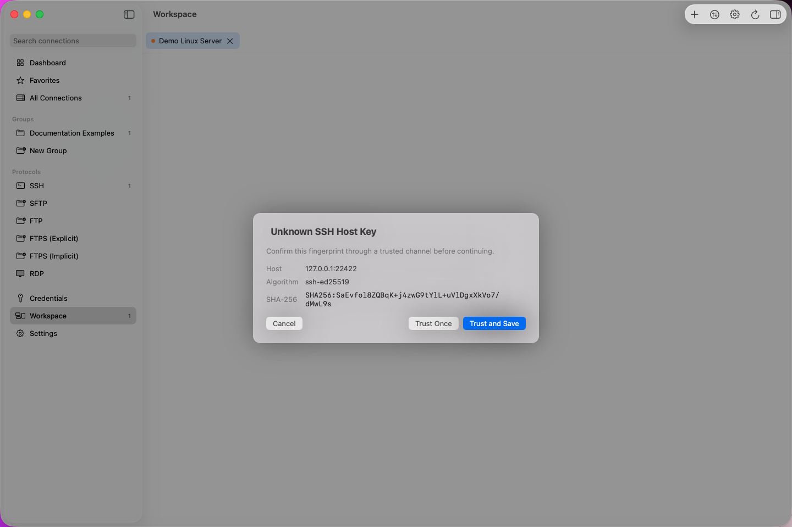
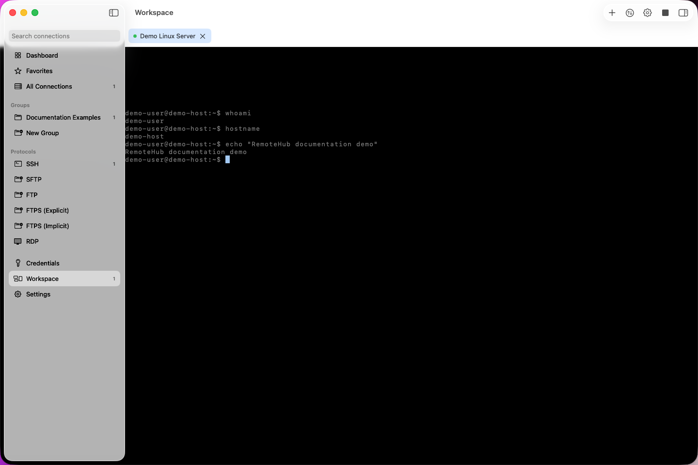
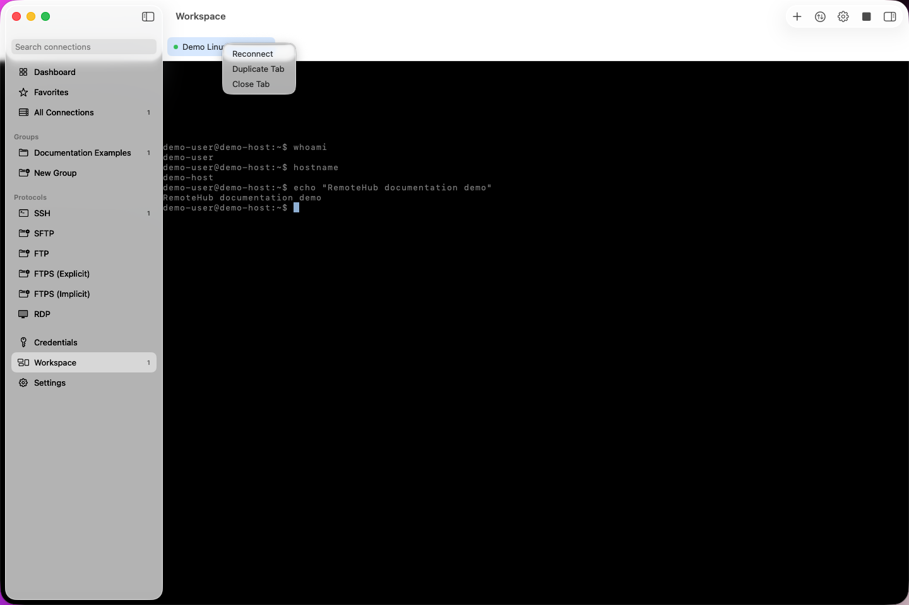

# Getting Started

This guide covers the first SSH workflow in the current development build.
The screenshots use isolated non-production demo data.

After completing this walkthrough, continue with the
[complete RemoteHub user guide](index.md).

## Requirements

- macOS 14 or newer for the application; macOS 15 or newer for an interactive
  SSH terminal.
- A current full Xcode installation. Command Line Tools alone do not provide
  the SwiftData macro plug-in required by the full build.
- Network access to an SSH endpoint you are authorized to use.
- The expected SSH host-key algorithm and SHA-256 fingerprint from a trusted,
  independent source.
- A username plus either a password or a supported OpenSSH Ed25519/RSA private
  key.

FreeRDP is required only for RDP. It is not required for this SSH workflow and
is not installed by RemoteHub.

## Build and launch

From the repository root:

```bash
make bootstrap
make build
make test
```

`make build` prints the location of the locally signed development
`RemoteHub.app`. To work in Xcode:

```bash
make open
```

Select the `RemoteHub` scheme and run the application. If the wrong developer
directory is selected, select the full Xcode installation before retrying:

```bash
sudo xcode-select --switch /Applications/Xcode.app
```

The checked-in application target and build settings are defined in
[`project.yml`](../../project.yml). The generated Xcode project is already
included in the repository.

## Create a credential

1. Open **Credentials** in the sidebar.
2. Select **New Credential**.
3. Enter a descriptive display name and the SSH username.
4. Choose **Username and Password** for a password-authenticated endpoint.
5. Enter and confirm the password.
6. Leave **Save securely in macOS Keychain** enabled if the password should be
   reused.
7. Select **Save**.



*A password credential with a fictional display name and username, empty
password fields, and the macOS Keychain option enabled.*

For private-key authentication, select the matching private-key option and
choose an authorized key file. RemoteHub stores the selected file reference and
display path as metadata; the current “bookmark” field contains path bytes, not
a macOS security-scoped bookmark. RemoteHub does not import the private key
into Keychain. Only a saved key passphrase is a Keychain secret.

If **Ask Every Time** is selected, the connection prompt states that the
entered value is used only for that attempt and is not saved.

See [Credentials](credentials.md) for stored-secret replacement and removal,
private-key boundaries, and authentication limitations.

## Create an SSH connection

1. Press **Command-N** or select **New Connection**.
2. Enter a non-sensitive connection name.
3. Select **SSH**.
4. Enter the host and port.
5. Select the credential profile created above.
6. Review **Initial remote directory** and **Terminal type**. The default
   terminal type is `xterm-256color`.
7. Select **Save and Connect**, or save first and connect from the connection
   library.



*A fictional SSH profile showing the host, port, credential, initial remote
directory, terminal type, tags, and notes used for this guide.*

Do not place passwords or authenticated URLs in the host, tags, or notes
fields. Connection metadata is local but is not treated as a secret boundary.
See [Connections](connections.md) for all profile fields, organization,
search, and protocol-specific limitations.

## Verify the SSH host key

On first contact, RemoteHub scans the endpoint's supported host keys, then
validates the exact key presented by the real SSH handshake. The prompt shows
the endpoint, negotiated algorithm, and SHA-256 fingerprint.



*The real RemoteHub trust prompt for the exact Ed25519 key presented by an
authorized, localhost-only disposable SSH endpoint at `127.0.0.1:22422`.*

Compare the displayed algorithm and fingerprint with information received
through a separate trusted channel.

- **Cancel** stops the connection.
- **Trust Once** accepts the exact presented key for this attempt only.
- **Trust and Save** stores the exact host, port, algorithm, fingerprint, and
  key data for future comparisons.

If the same host, port, and algorithm later presents a different fingerprint,
RemoteHub blocks the connection. Use **Review Replacement…** only after an
independent verification; replacement requires the separate
**I Verified It — Replace Key** action. A newly presented additional algorithm
is evaluated independently rather than inheriting trust from another
algorithm.

## Open and use the terminal

After host-key validation and authentication succeed, RemoteHub opens a
workspace tab containing the SwiftTerm terminal. Click the terminal before
typing if it does not already have focus.



*An interactive terminal connected to the disposable endpoint and displaying
only neutral identity checks and harmless demonstration output.*

Terminal input, output, resize events, cancellation, and stream completion are
implemented by the SSH PTY controller. The **Toggle Remote Files** command
(`Command-Shift-F`) opens the SFTP pane on the same SSH session when available.

## Disconnect, close, or reconnect

- **Disconnect** closes the active protocol sessions but leaves the workspace
  tab visible.
- **Reconnect** starts the connection flow again.
- **Command-R** reconnects or refreshes the active tab.
- The tab close button or **Command-W** closes the active tab and initiates
  disconnect.



*The active demo workspace with its Reconnect menu and connected-session
Disconnect and remote-files controls.*

Closing or reconnecting cancels the active task before the session is
disconnected. Automatic reconnect is modeled in the editor but is not active
in the current implementation.

## Where data and secrets are stored

| Data | Storage boundary |
| --- | --- |
| Connections, groups, credential metadata, known SSH host keys, and recent attempt categories | Local SwiftData store in the standard per-user application storage selected by SwiftData |
| Saved login passwords and SSH key passphrases | macOS Keychain service `com.alhnedi.RemoteHub.credentials`; non-synchronizing and available only while the device is unlocked |
| Preferences | Local `UserDefaults` |
| SSH private key | Remains at the user-selected filesystem location; reference metadata is stored with the credential profile |
| Export files | User-selected JSON files; secrets and private-key contents are excluded |
| Terminal content | Not intentionally persisted by RemoteHub |

The application is not App-Sandboxed. Treat local connection metadata,
screenshots, and exports according to the sensitivity of the systems they
describe.

## Common first-run problems

This section covers only immediate first-use failures. See
[Troubleshooting](troubleshooting.md) for the complete symptom-based guide.

### The build reports missing SwiftData macros

Install/select full Xcode, then rerun `make bootstrap` and `make build`.

### Interactive SSH is unavailable on macOS 14

Citadel's public PTY API requires macOS 15. Upgrade macOS or use an SFTP-only
profile.

### The host key is unknown

This is expected on first contact. Verify the exact algorithm and fingerprint
independently before choosing a trust action.

### The host key changed

Do not bypass the warning. A changed key can be legitimate after server
maintenance, but can also indicate redirection or interception. Verify through
a separate trusted channel before explicit replacement.

### Authentication failed

Confirm that the endpoint accepts the configured method and that the username,
password, key format, and passphrase are correct. SSH-agent authentication and
keyboard-interactive MFA are not supported claims for this release.

### FTP refuses to connect

Plain FTP requires explicit acknowledgement in the connection editor because
credentials and traffic are not encrypted.

### FTPS reports a certificate error

Certificate verification is enabled by default. Correct the endpoint
certificate or trust configuration; disabling certificate verification weakens
the connection.

### RDP reports that FreeRDP is missing or incompatible

Debug builds can discover or select a compatible FreeRDP client. Distributable
release builds require the separately reviewed bundled payload. RemoteHub
refuses automatic password delivery when the selected client lacks safe
standard-input support; there is no command-line password fallback.

### More diagnostics are needed

Open **Show Details** on the error banner, review the sanitized content, and use
**Copy Diagnostics**. Inspect copied text before sharing it and do not add
endpoint or credential details.

## Screenshot review

The five screenshots were captured from the RemoteHub application with an
isolated in-memory data store and a localhost-only disposable SSH endpoint.

| Filename | Screen or workflow | Public data | Dimensions | Review status |
| --- | --- | --- | --- | --- |
| `credential-editor.png` | New password credential before save | Synthetic display name and demo username; empty password fields | 1440×960 PNG | Reviewed for public release |
| `new-connection.png` | New SSH connection editor | Synthetic profile, reserved `.test` domain, demo paths and tags | 1440×960 PNG | Reviewed for public release |
| `host-key-prompt.png` | Unknown negotiated SSH host-key prompt | `127.0.0.1`, disposable port, and disposable host-key fingerprint | 1440×960 PNG | Reviewed for public release |
| `ssh-terminal.png` | Connected terminal workspace | `demo-user`, `demo-host`, and harmless demo output | 1440×960 PNG | Reviewed for public release |
| `session-controls.png` | Connected workspace controls | Same synthetic terminal content | 1440×960 PNG | Reviewed for public release |

Each image was visually inspected at full resolution. No sensitive pixels
required replacement because the retained content was created entirely from
isolated demo data. Native app-window captures exclude the Dock, notifications,
and unrelated desktop content.

## Evidence and known limitations

Implementation references:

- [`CredentialEditorView.swift`](../../RemoteHub/Features/Credentials/CredentialEditorView.swift)
- [`ConnectionEditorView.swift`](../../RemoteHub/Features/Connections/ConnectionEditorView.swift)
- [`PromptViews.swift`](../../RemoteHub/Features/Workspace/PromptViews.swift)
- [`WorkspaceView.swift`](../../RemoteHub/Features/Workspace/WorkspaceView.swift)
- [`WorkspaceStore.swift`](../../RemoteHub/Features/Workspace/WorkspaceStore.swift)
- [`CredentialStore.swift`](../../RemoteHub/Infrastructure/Keychain/CredentialStore.swift)

See [Known limitations](../known-limitations.md) before relying on an
unverified protocol workflow.
